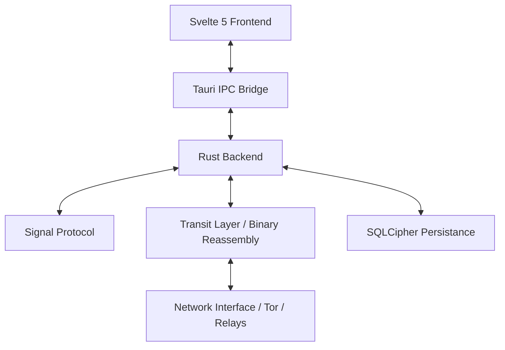

# Entropy Technical Architecture

This document provides a high-level overview of the internal architecture of the Entropy desktop application.

## High-Level Overview

Entropy is a hybrid application built with **Rust (Tauri)** for its core security logic and **Svelte 5** for its high-performance, reactive user interface.

## 1. Cryptographic Primitives

### Post-Quantum Signal (PQXDH)
Entropy implements a Post-Quantum version of the Signal protocol.
*   **Key Agreement**: Uses Kyber-1024 for post-quantum resistance.
*   **Ratchet**: Implements the Standard Double Ratchet for forward secrecy and post-compromise security.
*   **Identity**: Identities are unique 256-bit hashes derived from established Signal keys.

### Local Storage (The Vault)
Local data (messages, contacts, media) is never stored in plaintext.
*   **Database**: Encrypted SQLite (SQLCipher) using AES-256.
*   **Media**: Binary assets are stored in a dedicated media vault, encrypted with keys generated per-transfer.

## 2. Networking & Transit

### The Transit Layer
The Transit Layer handles the reliable delivery of large or sensitive payloads over an unreliable, metadata-resistant network.
*   **Fragmentation**: Large payloads (media, large messages) are split into 1319-byte fragments before transmission.
*   **Reassembly**: Each fragment contains a Transfer ID (TID), Index, and Total count. The receiver buffers fragments in a memory-safe assembler until the full payload is ready for decryption.
*   **Security**: The assembler enforces strict limits on fragment counts and buffer sizes to prevent resource exhaustion attacks.

### Routing & Privacy
*   **Direct**: Standard P2P routing.
*   **Tor**: Optional routing through the Tor network for anonymity.
*   **Dummy Pacing**: Intermittent dummy pacing is utilized to mask traffic patterns and disrupt timing-based analysis and metadata leaks.

## 3. Anti-Spam (VDF-PoW)
To prevent network flooding and spam without compromising privacy, Entropy implements a **Verifiable Delay Function (VDF)** based Proof-of-Work.
*   **Mechanism**: Sequential squaring mod $N$.
*   **Verification**: The result can be verified instantly by the relay, forcing an intentional cost on the sender while maintaining minimal overhead for the relay.

## 4. Front-End Architecture
The UI is detached from the networking logic to ensure Responsiveness.
*   **Svelte 5 Runes**: Used for efficient state management across the global `userStore` and `messageStore`.
*   **IPC Bridge**: All sensitive logic (encryption, networking) is kept strictly in the Rust backend, accessible only via secure Tauri commands.

---

*For detailed implementation details, see the inline technical documentation in `src-tauri/src/`.*
